## Task Manager: K8s Microservices with Monitoring Stack

### Goals

- Build production-ready Kubernetes deployment with multi-tier application
- Implement comprehensive observability using Prometheus + Grafana
- Enable AI-powered incident investigation with HolmesGPT integration
- Learn DevOps fundamentals through hands-on practice

### Technologies Used

#### Application Stack

- Frontend: React 18, Nginx (reverse proxy)
- Backend: Python Flask, PostgreSQL
- Containerization: Docker

#### Kubernetes Infrastructure

- Orchestration: Kubernetes (Minikube local)
- Deployments: StatefulSet (Postgres), Deployments (Frontend/Backend)
- Storage: PersistentVolumeClaim for data persistence
- Networking: Services (ClusterIP, NodePort), Ingress

#### Configuration Management

- ConfigMaps: Non-sensitive config (DB host, ports, app settings)
- Secrets: Sensitive data (DB credentials)
- Environment Variables: Runtime configuration injection

#### Observability Stack

- Monitoring: Prometheus (metrics collection, time-series DB)
- Visualization: Grafana (dashboards, alerting)
- Metrics: Prometheus client library (custom app metrics)
- ServiceMonitors: Automatic service discovery for scraping

#### DevOps Tools

- IaC: Terraform (planned for cloud)
- Package Management: Helm (kube-prometheus-stack)
- Version Control: Git
-  Container Registry: Docker Hub

### Steps to do:

#### 1. I built simple back and front end and built images from them. 
- create docker images for backend and front: <br>
``` docker build -t tea174/app-deploy-k8s-ex2-backend:v1 .``` <br>
```docker tag tea174/app-deploy-k8s-ex2-backend:v1 ghcr.io/tea174/app-deploy-k8s-ex2-backend:v1 ``` <br>
``` docker push ghcr.io/tea174/app-deploy-k8s-ex2-backend:v1 ``` <br>
  Same for frontend <br>


#### 2. Exec kubectl (2 ways):
##### From project root (app-deploy-ex2/)
```kubectl delete -f infrastructure/``` <br>
```kubectl apply -f infrastructure/ -n ex2-dev```

##### Or apply in Order
1. ConfigMap and Secret first
```kubectl apply -f infrastructure/configmap.yaml``` <br>
```kubectl apply -f infrastructure/postgres-statefulset.yaml```

2. Wait for postgres to be ready <br>
```kubectl wait --for=condition=ready pod -l app=postgres -n ex2-dev --timeout=60s```

3. Deploy backend <br> 
```kubectl apply -f infrastructure/backend-deployment.yaml```

4. Deploy frontend <br>
```kubectl apply -f infrastructure/frontend-deployment.yaml```

Run ```minikube service frontend-service -n ex2-dev``` to see the website
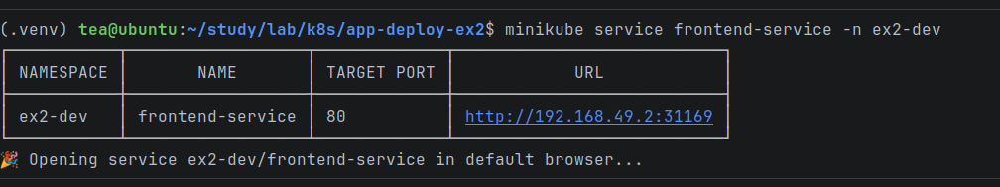
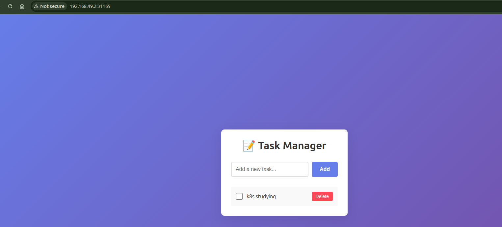

DB updated instantly when I added new data :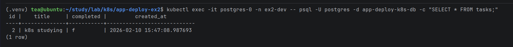


#### 3. To scale Up Replicas
I change replicas in frontend-deployment.yaml and backend-deployment.yaml from 1 to 2.
- Apply Changes
```kubectl apply -f infrastructure/backend-deployment.yaml``` <br>
```kubectl apply -f infrastructure/frontend-deployment.yaml```

- Before applying changes: 
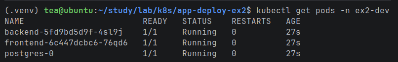

- After applying changes:
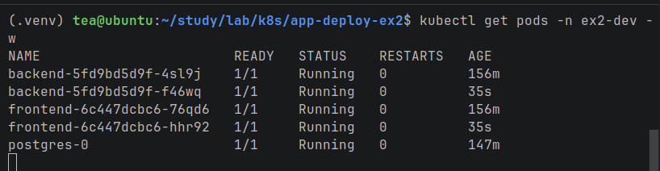

- Test LoadBalancing (after deleting the pod and refresh brower, data is still there) <br>
  ``` kubectl delete pod -l app=backend -n ex2-dev --force --grace-period=0```

#### 4. Add Monitoring with Prometheus & Grafana
##### Install kube-prometheus-stack
- Add Prometheus Helm repo <br>
```helm repo add prometheus-community https://prometheus-community.github.io/helm-charts``` <br>
```helm repo update```

- Install in ex2-dev namespace
 ```helm install prometheus prometheus-community/kube-prometheus-stack \  ```
   ```-n ex2-dev \ ```
  ```--set prometheus.prometheusSpec.serviceMonitorSelectorNilUsesHelmValues=false```

- Wait for all prometheus/grafana pods to be Running <br>
 ``` kubectl get pods -n ex2-dev -w```
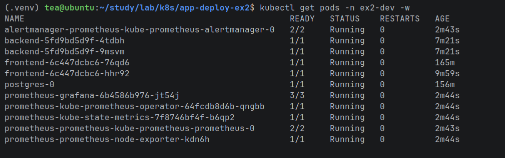

##### Access Grafana
- Get Grafana service 
```kubectl get svc -n ex2-dev | grep grafana```
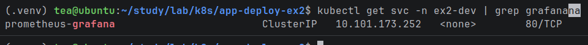
- Port-forward to access
  ```kubectl port-forward -n ex2-dev svc/prometheus-grafana 3000:80```

- Get the actual password from Secret <br>
```kubectl get secret prometheus-grafana -n ex2-dev -o jsonpath="{.data.admin-password}" | base64 --decode```
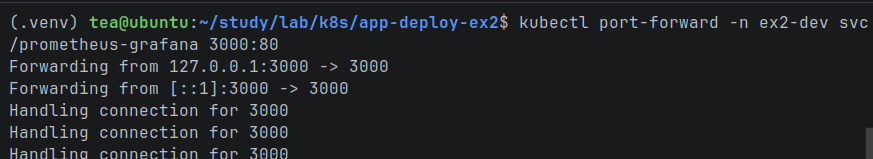
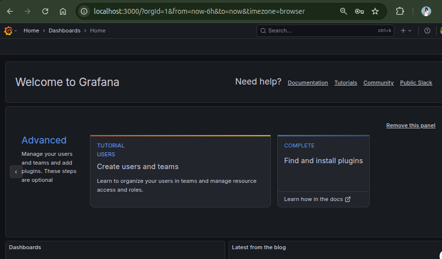
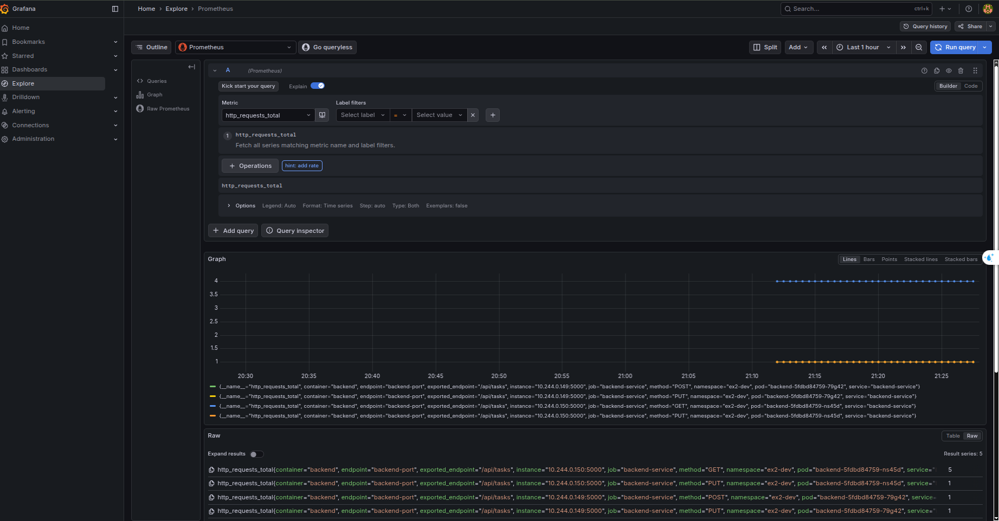

- Port-forward Prometheus
``kubectl port-forward -n ex2-dev svc/prometheus-kube-prometheus-prometheus 9091:9090``
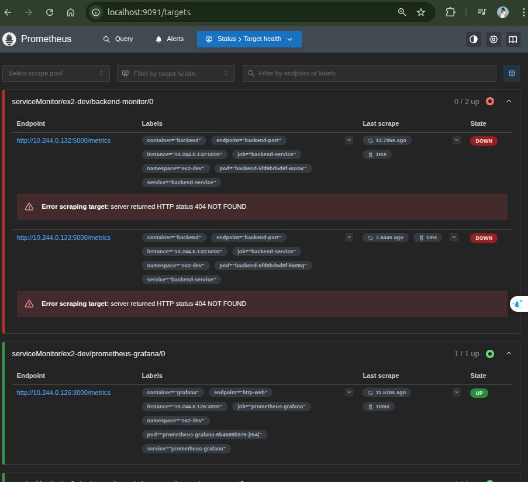


- Set up local access to Kubernetes pod for testing/debugging:
  ``POD_NAME=$(kubectl get pods -n ex2-dev -l app=backend -o jsonpath="{.items[0].metadata.name}")
  `` <br>
``kubectl port-forward $POD_NAME 8080:5000 -n ex2-dev``
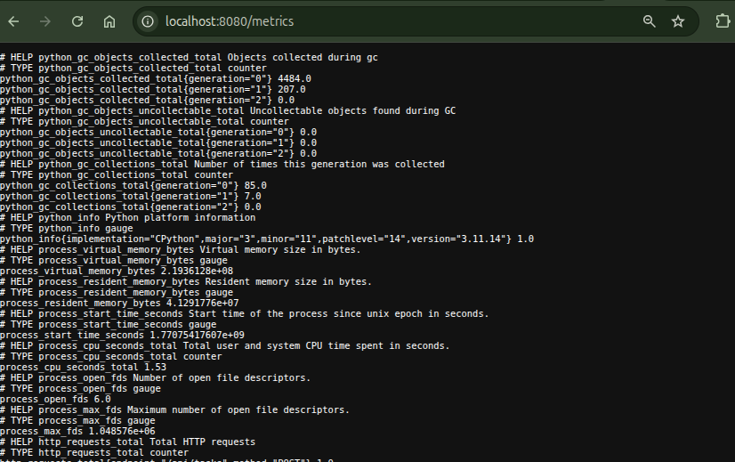


